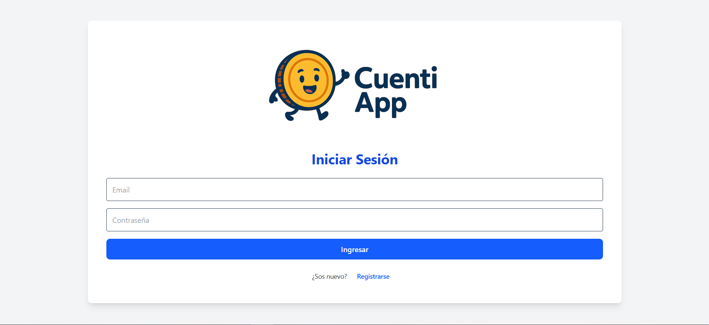
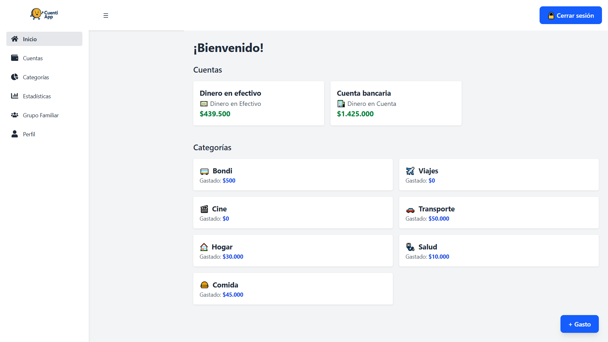
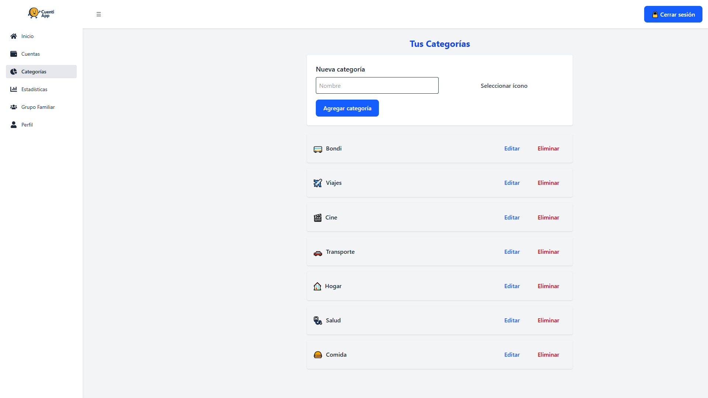
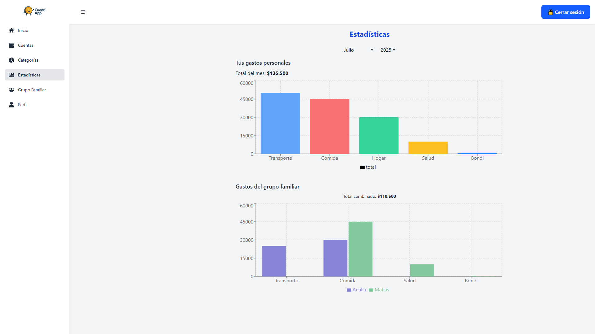

# 💸 CuentiApp

**CuentiApp** es una aplicación web para llevar un control detallado de tus gastos personales y familiares. Podés crear categorías personalizadas, registrar tus gastos por fecha y cuenta, y visualizar estadísticas para mejorar tu salud financiera.

---

## 🚀 Tecnologías utilizadas

- **Frontend:** React + Vite  
- **Backend:** Node.js + Express  
- **Base de datos:** MongoDB  
- **Autenticación:** JWT

---

## 📂 Estructura del proyecto

```
CuentiApp/
├── backend/     # API REST con Express
└── frontend/    # Aplicación React (Vite)
```

---

## 🧑‍💻 Instalación

### Clonar el repositorio

```bash
git clone https://github.com/matiasngiambra/CuentiApp.git
cd CuentiApp
```

### Backend

```bash
cd backend
npm install
# Crear archivo .env con tus variables (ej: JWT_SECRET, MONGO_URI)
npm run dev
```

### Frontend

```bash
cd ../frontend
npm install
npm run dev
```

---

## ✅ Funcionalidades principales

- Registro y login de usuarios
- Gestión de cuentas (efectivo, cuenta bancaria, billetera virtual)
- Creación de categorías con iconos y colores
- Registro de gastos con descripción, monto, cuenta y fecha
- Estadísticas visuales por mes y categoría
- Gestión de grupo familiar (máximo 2 miembros)
- Validaciones automáticas de saldo disponible

---

## 📸 Capturas de pantalla

### Vista de inicio de sesión


### Pantalla principal


### Pantalla de categorías


### Estadísticas mensuales


---

## 📌 Estado actual

✅ Funcionalidad completa  
🧪 Tests en desarrollo  
🧼 Refactor final y documentación en curso

---

## 📄 Licencia

Este proyecto es de uso académico y personal. Podés adaptarlo o inspirarte en él para tus propios fines. 💙
